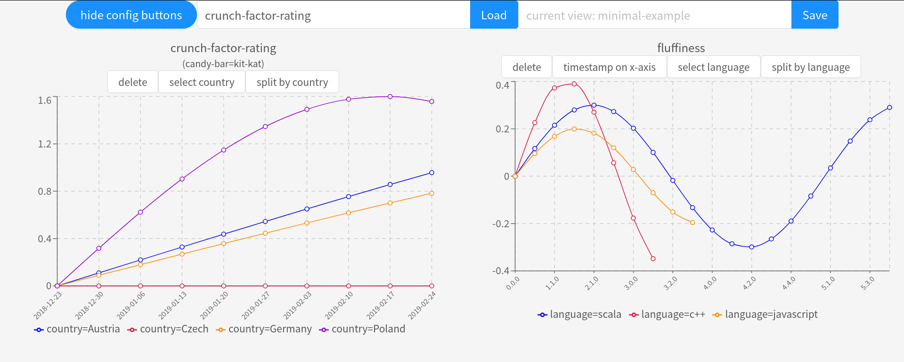

# KPYay - nanoscale data visualization.

    

A visualization project that aims to:
- provide pretty, **easily adjustable dashboards,** 
- **support highly parameterized metrics,**
- require as little configuration as possible,
- (make me learn a bit of TypeScript and React)

The last point requires least explanation - if you want something production-ready, 
check out something like [Grafana](https:////grafana.com) or [Kibana](https://www.elastic.co/kibana).

Regarding the other ones...

### As little configuration as possible
KPYay tries to provide pretty dashboards with certain convenient transformations oriented around 
highly-parameterized measurements. To make these transformations possible, 
it uses it's own data storage and an opinionated API.

In other words, you need to send it your data, but the API is as simple as it gets:

    curl --data '{"value": 0.8967}' "$KPYAY_URL/points/sloths-vs-pastry-f-score"
    
This will attach current timestamp to your value and add 
it to data series associated with metric `sloths-vs-pastry-f-score`. 

You can also provide the timestamp ([RFC3339](https://tools.ietf.org/html/rfc3339) truncated to seconds) 
yourself - e.g. when you already have some historical data you'd like to use:

    curl --data '{"value": 0.8967, "timestamp": "2020-04-05T18:30:00"}' "$KPYAY_URL/points/sloths-vs-pastry-recall"

Sometimes it makes more sense to label measurements with a version. This:

    curl --data '{"value": 0.8967, "version":[1, 0, 0]}' '$KPYAY_URL/points/dogs-vs-muffins-classifier-f-score'

will allow you to toggle between versions and timestamps on the chart x-axis.

The last part of the API is `params`:

    curl --data '{"value": 14.67, "params": {"soda": "pepsi"}}' "$KPYAY_URL/points/sodas-market-share"

in this example `sodas-market-share` may contain series for each variant of `soda=pepsi|coke|fanta|mountain-dew|...`.

  
The only catch is that once a data point is submitted, all consecutive ones must stick to the same schema.

E.g. if you POSTed `'{"value": 14.67, "params": {"soda": "pepsi"}}'` to `sodas-market-share`, 
all consecutive POSTs to `sodas-market-share` must:
- provide `"params": {"soda": $SODA_VARIANT}` 
- omit `timestamp`,
- omit `version`.

### Highly parameterized data
With more than one `param` the chart readability may quickly get out of hand:

    

This project provides one-click way to transform this chart into more readable one(s) - 
that's what the `split by` and `select` buttons do. Clicking "select candy-bar -> kitkat" results in:

    

Clicking "split-by -> kit-kat" would create three similar charts - one for each type of candy bar.

### How to run
The easiest way is `python utils/spawn_test_server.py`, which also inserts demo content,
but it requires installed Rust 1.43 toolchain, redis-server and a few python packages.

Compilation via container is another option:

    # compiling
    cd ./server
    docker run --rm -it -v "$(pwd)":/home/rust/src ekidd/rust-musl-builder cargo build

    # running Redis + server
    REDIS_PORT=9000
    docker run -d \
        -p $REDIS_PORT:6379 \
        --name=kpyay-redis \
        -v kpyay-redis-vol:/data \
        redis
    ./target/x86_64-unknown-linux-musl/debug/kpyay-server redis://127.0.0.1:$REDIS_PORT/

    # running the front ent
    cd front && npm start

This method - unlike `spawn_test_server.py` - doesn't insert demo content.

### Missing pieces
- the front end could use some more prettification,
- the server implementation:
    - needs to enforce the constraint: 'once a data point is submitted, all consecutive ones must stick to the same schema',
    - is currently littered with `.unwrap()`s - they needs to be replaced by civilized error handling,
- unit tests coverage is poor (though there are some API integration tests)

### Extensions?
- metric ids, parameter names and parameter values should probably be constrained with some regex, 
- it would be useful to be able to "move" data series.  
    Let's say you have collected some historical data on `no-metallica-concerts` in US, 
    but you decided to track it in other countries as well. 
    - original `no-metallica-concerts` metric could be "renamed" to `deprecated-$DATE--no-metallica-concerts`,
    - the content of `deprecated-$DATE--no-metallica-concerts` could be downloaded 
        and reposted with `"params": {"country": "US"}`, along with data for other countries.  
        
    It would require handling these transformations for previously defined dashboards so they still show the same data.
